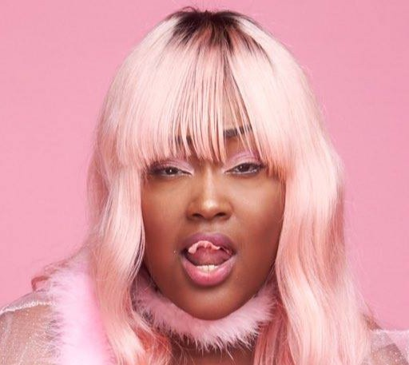

  

<h1 align="center">ChudSampler</h1>

  <b>ChopSampler branch that doesn't use TD-PSOLA to synthesize harmonics</b>

  From Chop to Chud

  
  

---

## Why the name ChudSampler?

Because this resampler is a chopped chud just like MLo7

---

## ✨ Flag List | count: 12

NOTE: These flags are the same so um yea

| Flag | Range    | Default | Description |
|------|----------|---------|-------------|
| `g`  | `-100`-`100`  | `0` | Formant shift. Gender effect |
| `t`  | `-100`-`100`  | `0` | Off cent flag |
| `V`  | `0`-`100`     | `100` | Harmonic (voiced) level |
| `B`  | `-100`-`100`  | `0`   | Breathiness level |
| `U`  | `-100`-`100`  | `0`   | Unvoiced (fricative) level |
| `P`  | `0`-`100`      | `0`  | Normalization |
| `dg` | `0`-`100`     | `0`   | Distortion Growl effect|
| `dgs` | `0`-`100`     | `75`   | Rate of `dg` modulation|
| `fg` | `0`-`100`     | `0`   | Fry Growl effect|
| `gg` | `0`-`100`     | `0`   | Guttural Growl effect|
| `fv` | `0`-`1`     | `0`   | Force every frames to be voiced frame (affected by pitch)|
| `tn` | `-100`-`100`     | `0`   | Tension |
